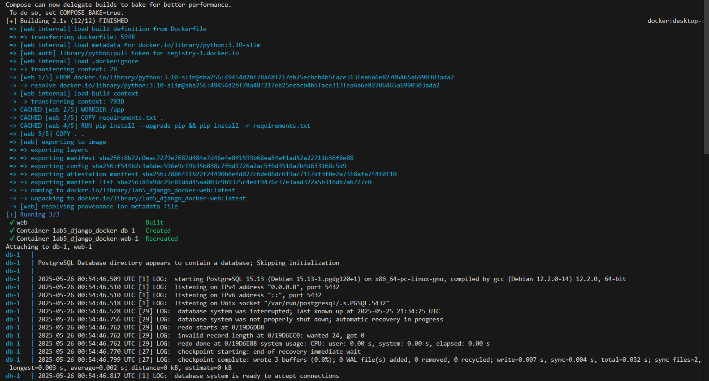
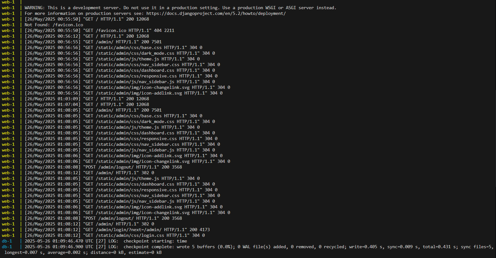
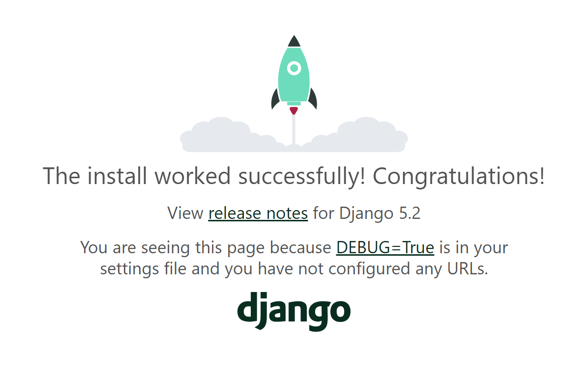
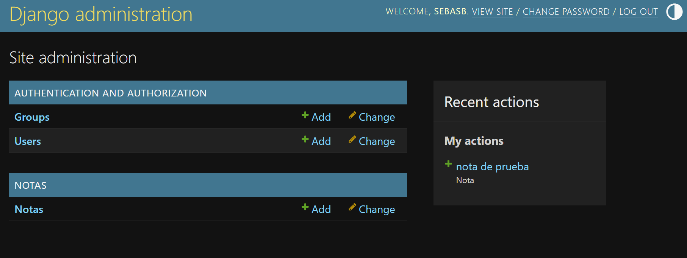

# Laboratorio 5: Despliegue de una aplicación Django con Docker, Infraestructura, Persistencia y redes.
# Carlos Moya Saenz, C15346. Sebastian Bonilla Vega,C01263.

## 📐 Arquitectura del Sistema

El entorno está compuesto por dos contenedores definidos con Docker Compose:

- `web`: Contenedor que ejecuta la aplicación Django.
- `db`: Contenedor con PostgreSQL para la base de datos.

Ambos se comunican por una red interna llamada `red_local` y comparten un volumen persistente para los datos del contenedor de base de datos.

### Diagrama de arquitectura

```
┌────────────┐      red_local      ┌─────────────┐
│   web      │◀──────────────────▶│     db     │
│ Django app │                    │ PostgreSQL  │
└────────────┘                    └─────────────┘
     ▲
     │
     ▼
 localhost:8000 (expuesto)
```

## 📁 Estructura del Proyecto

```
lab5_django_d...
├── myproject/
│   ├── __init__.py
│   ├── asgi.py
│   ├── settings.py
│   ├── urls.py
│   └── wsgi.py
├── notas/
│   ├── __init__.py
│   ├── admin.py
│   ├── apps.py
│   ├── migrations/
│   ├── models.py
│   ├── tests.py
│   └── views.py
├── .env
├── db.sqlite3
├── docker-compose.yml
├── Dockerfile
├── manage.py
├── README.md
└── requirements.txt
```

---

## ⚙️ Contenido de los Archivos Clave

### `docker-compose.yml`

Define y orquesta los servicios de la base de datos (`db`) y la aplicación web (`web`):

```yaml
version: '3.9'

services:
  db:
    image: postgres:15
    env_file: .env
    volumes:
      - postgres_data:/var/lib/postgresql/data
    networks:
      - red_local

  web:
    build: .
    command: python manage.py runserver 0.0.0.0:8000
    volumes:
      - .:/app
    ports:
      - "8000:8000"
    env_file: .env
    depends_on:
      - db
    networks:
      - red_local

volumes:
  postgres_data:

networks:
  red_local:
```

---

### `Dockerfile`

Construye una imagen personalizada para Django a partir de `python:3.10-slim`.

```dockerfile
FROM python:3.10-slim

ENV PYTHONDONTWRITEBYTECODE 1
ENV PYTHONUNBUFFERED 1

WORKDIR /app

COPY requirements.txt .
RUN pip install --upgrade pip && pip install -r requirements.txt

COPY . .

CMD ["python", "manage.py", "runserver", "0.0.0.0:8000"]
```

---

### `.env`

Archivo de configuración con credenciales y parámetros para la base de datos:

```dotenv
POSTGRES_DB=mi_basedatos
POSTGRES_USER=usuario
POSTGRES_PASSWORD=contrasena
DB_HOST=db
DB_PORT=5432
```

**Importante:** Este archivo es cargado por ambos servicios gracias a `env_file: .env`. No debe subirse a repositorios públicos.

---

### `requirements.txt`

Lista de dependencias necesarias para que funcione el proyecto:

```
asgiref==3.8.1
Django==5.2.1
psycopg2-binary==2.9.10
sqlparse==0.5.3
tzdata==2025.2
```

---

## 🚀 Instrucciones para Ejecutar el Entorno desde Cero

1. **Clonar el repositorio (si aplica):**
   ```bash
   git clone <url-del-repositorio>
   cd <carpeta-del-proyecto>
   ```

2. **Crear el archivo `.env`:**
   Copiar y rellenar el archivo `.env` con las variables necesarias:

   ```dotenv
   POSTGRES_DB=mi_basedatos
   POSTGRES_USER=usuario
   POSTGRES_PASSWORD=contrasena
   DB_HOST=db
   DB_PORT=5432
   ```

3. **Construir y ejecutar los contenedores:**
   ```bash
   docker-compose up --build
   ```
---
4. **Acceder a la aplicación:**
   Ir a [http://localhost:8000](http://localhost:8000) para verificar que se creo la aplicación.
---
5. **Crear un super usuario:**
Cómo se comparte entre desarrolladores, es mejor crear un super usuario ;D. Se ejecuta el comando:
 ```
   docker-compose exec web python manage.py createsuperuser 
 ```
Y después se selecciona un nombre de usuario y contraseña adecuada para poder acceder al programa. Luego, acceder a la siguiente página: [http://localhost:8000/admin/](http://localhost:8000/admin/). 
Además, es crucial tener descargada la aplicación de Docker, en la versión más actualizada y tenerla abierta a la hora de ejecutar los comandos en la terminal.

## 📸 Capturas de Pantalla


La captura anterior corresponde a la generación de la aplicación de Django a través del docker.

La captura anterior corresponde a cómo se vé la terminal mientras se navega a través de la apliación.

La captura anterior muestra cómo queda el local host después de correr el programa.

La captura final muestra cómo queda la aplicación desplegada después de crear el super usuario.

## ✅ Conclusión

Este proyecto ejemplifica el despliegue eficiente de una aplicación Django con una base de datos PostgreSQL, usando Docker para contenerización. La solución proporciona un entorno aislado, reproducible y fácil de desplegar en distintos entornos, lo que facilita la colaboración y mantenimiento del proyecto.