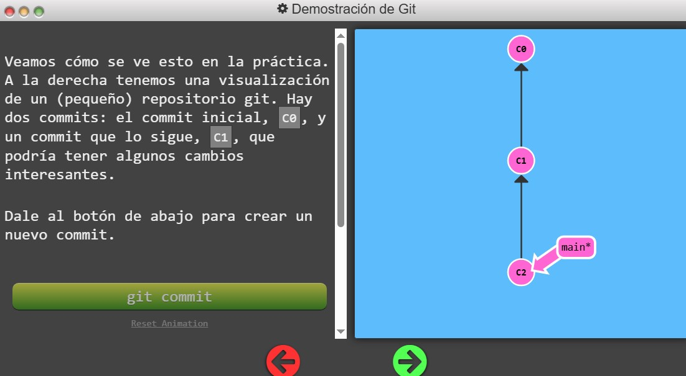
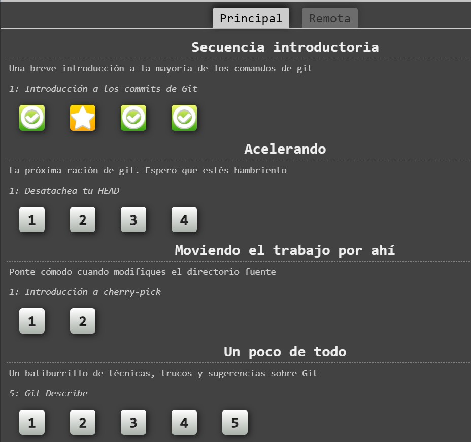
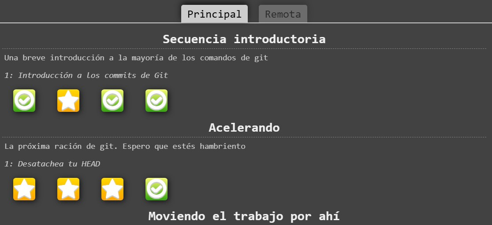
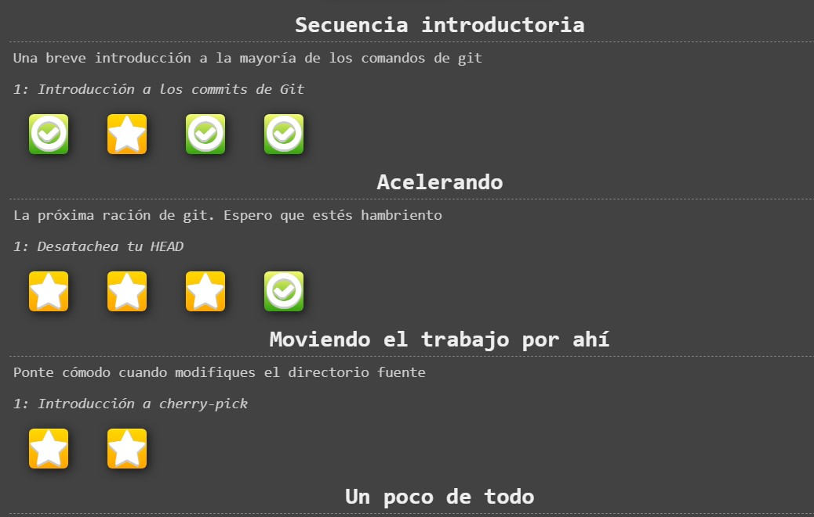
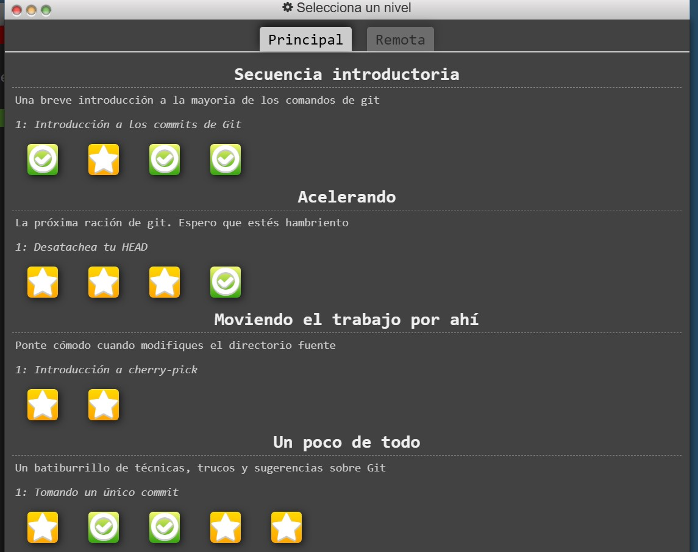
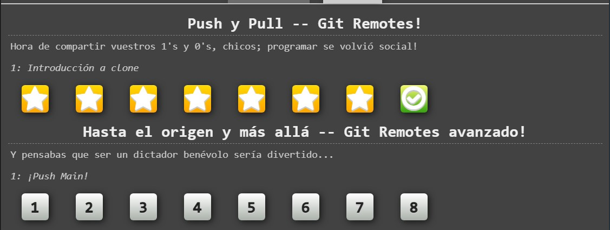
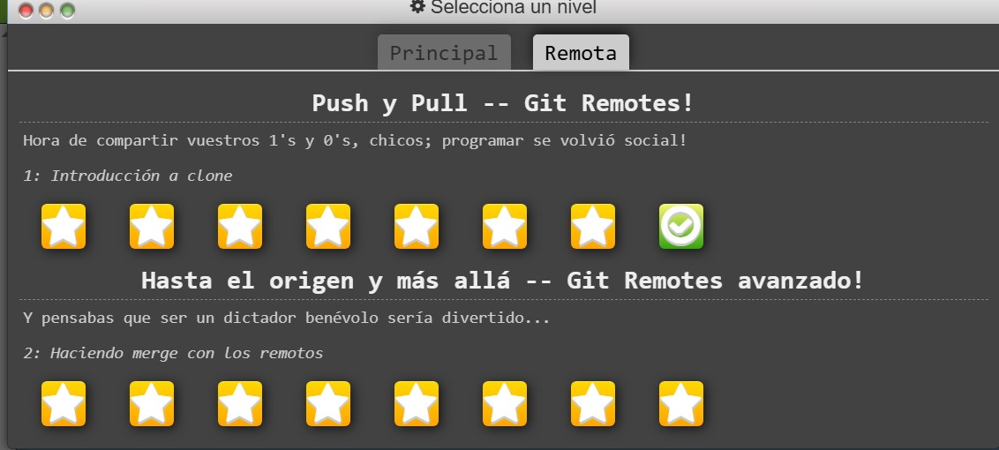

# Laboratorio 2: Control de versiones y documentación automática
## Parte 1 – Git y control de versiones
Para la parte de git y control de versiones se tienen las siguientes imágenes:

La imagen 1 corresponde al inicio de la práctica.

Prueba de haber completado la secuencia introductoria.

Prueba de haber completado la secuencia ´Acelerando´.

Prueba de haber completado la secuencia ´Moviendo el trabajo por ahí´.

Prueba de haber completado la secuencia ´Un Poco de Todo´.

Prueba de haber completado la secuencia de la parte Remota ´Git Remotes´.

Prueba de haber completado la secuencia de la parte Remota ´Git Remotes Avanzado´.

Realmente, las partes más complicadas fueron las secuencias de Acelerando y Git Remotes Avanzado, había que concentrarse mucho y requería mucho tiempo.

## Parte 2 –  Documentación automática en C++ y Python
[Link Sphinx](https://sebasbclef.github.io/ie0417/). En éste proyecto, se hizo un simualador de colisiones de bolas en Python. Dentro del link está mejor explicado y más detallado.

[Link Doxygen](https://67f986d7b8dd3f0a57967ffc--stately-boba-ce2605.netlify.app/globals.html). En éste proyecto, se hizo un tributo al juego clasico de Pong, ejecutado en la terminal. En el link se pueden accesar todas las clases, funciones y estructuras que permiten que el juego corra.
